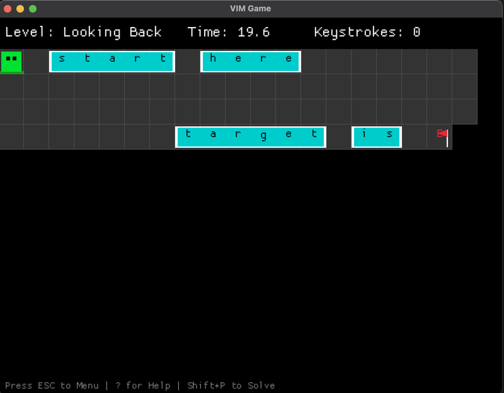

# VimGame

A puzzle game designed to help you master Vim navigation keys (`h`, `j`, `k`, `l`) and other commands. Navigate through increasingly complex levels, avoid obstacles, and reach the goal!

## 🎮 Play Online

You can play the latest version of the game directly in your browser:
[**Play VimGame**](https://craftyc0der.github.io/vimgame/)

## ✨ Features

- **Vim-based Movement**: Use `h`, `j`, `k`, `l` to move.
- **Advanced Commands**: Learn `w`, `b`, `f`, `t`, `/` and more as you progress.
- **Puzzle Solving**: 20 levels of increasing difficulty.
- **Auto-Solver**: Includes an A* pathfinding AI that can solve levels automatically.

## 📸 Screenshot


*(Note: Please add a screenshot named `screenshot.png` to the `assets` folder)*

## 🛠️ Installation

To build and run this game locally, you need to have **Rust** installed.

### 1. Install Rust

If you don't have Rust installed, you can install it via `rustup`:

```bash
curl --proto '=https' --tlsv1.2 -sSf https://sh.rustup.rs | sh
```

### 2. Clone the Repository

```bash
git clone https://github.com/cratyc0der/vimgame.git
cd vimgame
```

## 🚀 Usage

This project uses a `Makefile` to simplify common tasks. Here are the available commands:

### Native (Desktop)

- **`make run-native`**: Builds and runs the game on your local machine.
- **`make build-native`**: Compiles the game for release (optimized).
- **`make solve-all`**: Runs the game in "Auto-Solve" mode, where the AI attempts to solve all levels.

### Web (WASM)

- **`make run-web`**: Builds the WASM version and starts a local web server at `http://localhost:8000`.
- **`make build-web`**: Compiles the game to WebAssembly and prepares the `dist/` folder for deployment.

### General

- **`make test`**: Runs the Rust test suite.
- **`make clean`**: Removes build artifacts and the `dist/` directory.
- **`make all`**: Runs tests and builds both native and web versions.
